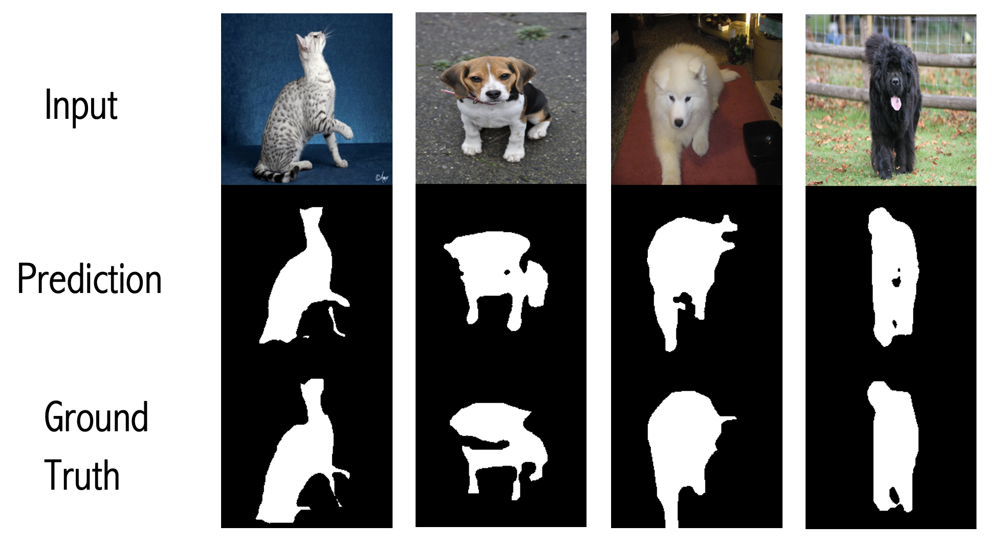
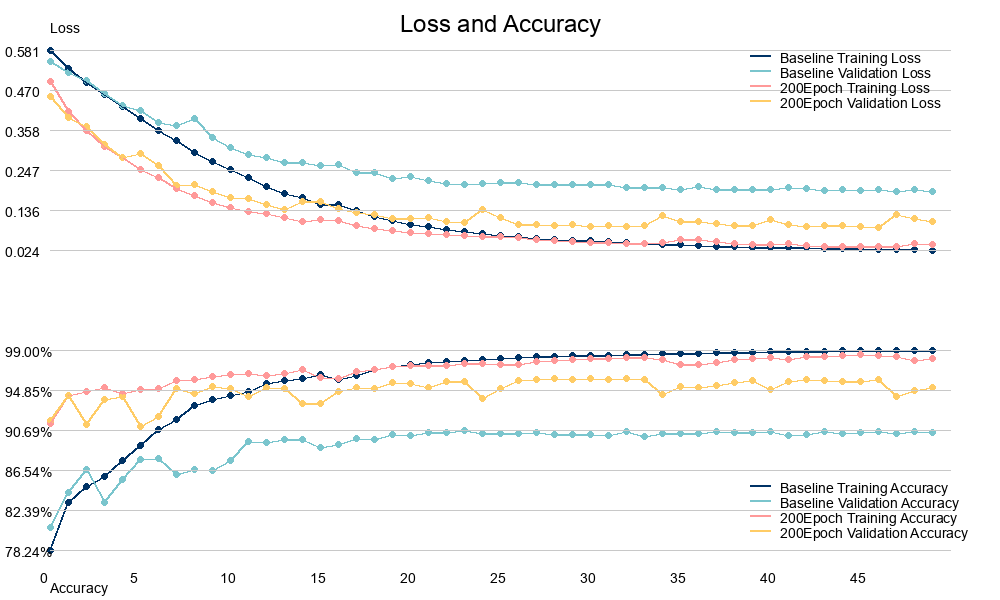

# Finetuning Masked Autoencoder Models for Image Segmentation

## Overview
The traditional supervised learning often requires large amounts of labeled data for training. However, acquiring such labeled data can be costly, time-consuming, and sometimes impractical. Self-supervised learning, on the other hand, offers a solution to this challenge. Instead of relying on externally labeled data, self-supervised learning leverages the inherent structure or relationships within the data itself to generate super- vision signals. Masked Autoencoders (MAE) [1] is one of the self-supervised approaches for computer vision tasks. The MAE method pre-trains an asymmetric autoencoder by masking random patches of the image and reconstructing the missing pixels. During the pre-training, the encoder is applied to a small subset of image patches and mask tokens. These data will be processed by the decoder that reconstructs the original images in pixel levels.

This project pre-trains a U-Net style autoencoder model and fine-tune it on Oxford-IIIT Pet dataset for binary segmentation tasks. 

## Authors
Yujie Wang (ucab211@ucl.ac.uk)  

Yuang Du (yuang.du.23@ucl.ac.uk)    

Harris Liu (ucabh01@ucl.ac.uk)  

Jiawei Ren (jiawei.ren.23@ucl.ac.uk)

## Build & Run

Pretrain: [Tutorial](https://github.com/Christol-Jalen/mae-segmentation/blob/main/finetune/README.md)

Finetune: [Tutorial](https://github.com/Christol-Jalen/mae-segmentation/blob/main/pretrain/README.md)

## Results

The fine-tune results are shown in the figure below, it has the following key metrics:

• Test Loss: 0.1899
• Accuracy: 90.5%

  

Comparing the pre-trained model with the baseline model.
The graph below shows the loss and accuracy with respect to training epochs, for both pre-trained model and the baseline model. In the loss graph, both training loss and vali-dation loss of the baseline model converge slower than the pretrained model, and the baseline model’s steady-state validation loss is also higher than the pretrained model. The same phenomenon is observed in terms of accuracy, where the baseline model’s accuracy converges slower, and the steady-state accuracy on validation dataset is low-er, compared to the pre-trained model.

  

## Reference

1.	He, K., Chen, X., Xie, S., Li, Y., Dollár, P. and Girshick, R., 2022. Masked autoencod-ers are scalable vision learners. In Proceedings of the IEEE/CVF conference on com-puter vision and pattern recognition (pp. 16000-16009).
2.	Tian, K., Jiang, Y., Diao, Q., Lin, C., Wang, L. and Yuan, Z., 2023. Designing bert for convolutional networks: Sparse and hierarchical masked modeling. arXiv preprint arXiv:2301.03580.
3.	Milletari, F., Navab, N. and Ahmadi, S.A., 2016, October. V-net: Fully convolutional neural networks for volumetric medical image segmentation. In 2016 fourth interna-tional conference on 3D vision (3DV) (pp. 565-571). Ieee.
